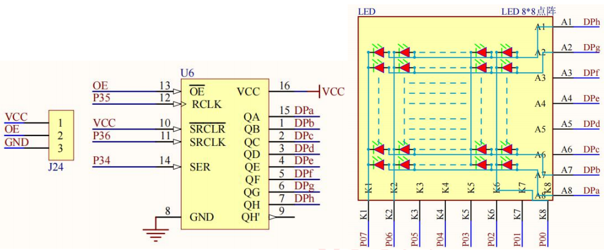

# LED-light-matrix
在普中-4开发板上的一个关于8*8LED灯的矩阵项目，能将数字0-9显示出来。
本项目包含完成功能的源文件和文本取模软件，可以经过改造后移植其他设备端。
本项目为减少C51的资源占用，使用74HC595电路（相当于3转而电路）。595电路利用端口P3.4作为数据输入，将P3.4发送到串行数据变成八路输出的并行数据。
每当P3.6连接的SRCLK产生一个上升沿，即可将P3.4的数据放置在八路并行输出引脚的最高位，依次向下。
每当P3.5连接的RCLK产生一个上升沿，即可将八路并行的端口一起输出。

# 硬件连接


最左边的电路J24把OE和GND连接即可开启74HC595芯片的功能。
中间的电路为74HC595芯片。
最右边的电路为8*8LED矩阵的电路，其列连接P0的八个口，其行连接74HC595芯片的并行输出的八路端口。

# 全部程序
先上全部程序，后面在做讲解
```c
#include "reg52.h"

typedef unsigned int u16;	//对系统默认数据类型进行重定义
typedef unsigned char u8;

//定义74HC595控制管脚
sbit SRCLK=P3^6;	//移位寄存器时钟输入
sbit RCLK1=P3^5;		//存储寄存器时钟输入,因为RCLK在头文件里面已经被定义过来，所以此处命名为RCLK1防止重命名。
sbit SER=P3^4; 		//串行数据输入

#define LEDDZ_COL_PORT	P0	//点阵列控制端口

u8 led_row[10][8]={												//点阵数字行扫描
					{0x00,0x7E,0x81,0x81,0x81,0x81,0x7E,0x00}, //数字0
					{0x00,0x00,0x41,0x41,0xFF,0x01,0x01,0x00}, //数字1
					{0x00,0x61,0x83,0x85,0x89,0x91,0x61,0x00}, //数字2
					{0x00,0x66,0x81,0x89,0x89,0x89,0x7E,0x00}, //数字3
					{0x18,0x28,0x48,0x88,0x7F,0x08,0x08,0x00}, //数字4
					{0x00,0x00,0xF9,0x89,0x89,0x89,0x8F,0x00}, //数字5
					{0x00,0x00,0xFF,0x89,0x89,0x89,0x8F,0x00}, //数字6
					{0x00,0x00,0x80,0x80,0x80,0x80,0xFF,0x00}, //数字7
					{0x00,0x00,0xFF,0x89,0x89,0x89,0xFF,0x00}, //数字8
					{0x00,0x00,0xF1,0x91,0x91,0x91,0xFF,0x00}  //数字9
				  };

u8 led_col[8]={0x7f,0xbf,0xdf,0xef,0xf7,0xfb,0xfd,0xfe};	//点阵列扫描
				  
void delay_10us(u16 ten_us)
{
	while(ten_us--);	
}

void hc595_write_data(u8 dat)
{
	u8 i=0;
	
	for(i=0;i<8;i++)//循环8次即可将一个字节写入寄存器中
	{
		SER=(dat>>7);//将数据dat里的高位向友位移八位到最低位，然后放到SER内，即实现优先传输一个字节中的高位
		dat<<=1;//将低位移动到高位
		SRCLK=0;
		//delay_10us(10);//在SRCLK产生上升沿的时候，才会把数据写入，其反应时间为nm级，所以延时可不带。 
		SRCLK=1;
		//delay_10us(10);//移位寄存器时钟上升沿将端口数据送入寄存器中	
	}
	RCLK1=0;
	delay_10us(1);
	RCLK1=1;//存储寄存器时钟上升沿将前面写入到寄存器的数据输出	
}


void main()
{	
	u8 i=0,j=0,k=0;

	LEDDZ_COL_PORT=0x00;//将LED点阵列全部设置为0，即LED阴极为低电平
	while(1)
	{		
		for(i=0;i<10;i++)
		{
			for(k=0;k<50;k++)
			{
			for(j=0;j<8;j++)
			{	
				LEDDZ_COL_PORT=led_col[j];//传送列选数据
				hc595_write_data(led_row[i][j]);//传送行选数据
				delay_10us(100);//延时一段时间，等待显示稳定
				hc595_write_data(0x00);//消影		
			}
			}
		}	
	}		
}
```

# 直接移植的部分
此处为程序中用来移植的功能子函数，具体一些端口更改可看注释,重复的定义和头文件引用可以删除。
```c
#include "reg52.h"
typedef unsigned char u8;	//对系统默认数据类型进行重定义

//定义74HC595控制管脚
sbit SRCLK=P3^6;	//移位寄存器时钟输入
sbit RCLK1=P3^5;		//存储寄存器时钟输入,因为RCLK在头文件里面已经被定义过来，所以此处命名为RCLK1防止重命名。
sbit SER=P3^4; 		//串行数据输入

#define LEDDZ_COL_PORT	P0	//点阵列控制端口

u8 led_row[10][8]={												//点阵数字行扫描
					{0x00,0x7E,0x81,0x81,0x81,0x81,0x7E,0x00}, //数字0
					{0x00,0x00,0x41,0x41,0xFF,0x01,0x01,0x00}, //数字1
					{0x00,0x61,0x83,0x85,0x89,0x91,0x61,0x00}, //数字2
					{0x00,0x66,0x81,0x89,0x89,0x89,0x7E,0x00}, //数字3
					{0x18,0x28,0x48,0x88,0x7F,0x08,0x08,0x00}, //数字4
					{0x00,0x00,0xF9,0x89,0x89,0x89,0x8F,0x00}, //数字5
					{0x00,0x00,0xFF,0x89,0x89,0x89,0x8F,0x00}, //数字6
					{0x00,0x00,0x80,0x80,0x80,0x80,0xFF,0x00}, //数字7
					{0x00,0x00,0xFF,0x89,0x89,0x89,0xFF,0x00}, //数字8
					{0x00,0x00,0xF1,0x91,0x91,0x91,0xFF,0x00}  //数字9
				  };

u8 led_col[8]={0x7f,0xbf,0xdf,0xef,0xf7,0xfb,0xfd,0xfe};	//点阵列扫描
				  
void delay_10us(u16 ten_us)
{
	while(ten_us--);	
}

void hc595_write_data(u8 dat)
{
	u8 i=0;
	
	for(i=0;i<8;i++)//循环8次即可将一个字节写入寄存器中
	{
		SER=(dat>>7);//将数据dat里的高位向友位移八位到最低位，然后放到SER内，即实现优先传输一个字节中的高位
		dat<<=1;//将低位移动到高位
		SRCLK=0;
		//delay_10us(10);//在SRCLK产生上升沿的时候，才会把数据写入，其反应时间为nm级，所以延时可不带。 
		SRCLK=1;
		//delay_10us(10);//移位寄存器时钟上升沿将端口数据送入寄存器中	
	}
	RCLK1=0;
	delay_10us(1);
	RCLK1=1;//存储寄存器时钟上升沿将前面写入到寄存器的数据输出	
}
```

# 移植程序在主函数中的调用
```c
void main()
{	
	u8 i=0,j=0,k=0;

	LEDDZ_COL_PORT=0x00;//将LED点阵列全部设置为0，即LED阴极为低电平
	while(1)
	{		
		for(i=0;i<10;i++)
		{
			for(k=0;k<50;k++)
			{
			for(j=0;j<8;j++)
			{	
				LEDDZ_COL_PORT=led_col[j];//传送列选数据
				hc595_write_data(led_row[i][j]);//传送行选数据
				delay_10us(100);//延时一段时间，等待显示稳定
				hc595_write_data(0x00);//消影		
			}
			}
		}	
	}		
}
```
